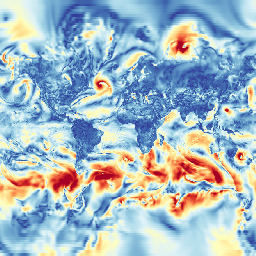

# About
This simple rust crate creates Web Mercator Tiles from netCDF datasets, suitable for Js viewer, such as leaflet.

It uses the [rust-netcdf](https://github.com/mhiley/rust-netcdf) to manipulate netCDF files.

This is a weekend project, don't expect too much of it.

Comments and feedback are welcomed and appreciated.

# Usage

## Documentation
The crate documentation is available [here](https://evomassiny.github.io/tiler-rs/tiler/index.html).

## Requirements

* This crate uses a [libnetcdf wrapper](https://github.com/mhiley/rust-netcdf), so you need to have the libnetcdf installed, on debian-based distro :
```bash
sudo apt-get install libhdf5-serial-dev netcdf-bin libnetcdf-dev
```

* Then you should be able to build it using the rust package manager *cargo*:
```bash
cargo build --release
```

* Run a test example (this will create tiles from the **examples_data/wind_magnitude_reduced.nc** file into *examples_data/cache*)
```bash
cargo run --release --example static_file_generator
```

## Example
Here is a simple example:

* In your Cargo.toml, add the following dependency:
```
tiler = { git = "https://github.com/evomassiny/tiler-rs.git", branch = "master" }

```

* In your code :
```rust
extern crate tiler;

fn main()  {
    // Create a dataset from a netCDF file
    let dataset = tiler::Dataset::new(
        "latitude",         // Name of the latitude dimension
        "longitude",        // Name of the longitude dimension
        "wind_magnitude",   // Name of the latitude dimension
        "./examples_data/wind_magnitude_reduced.nc" // Path to a dataset
    ).unwrap();

    // Create a renderer
    let renderer = tiler::Renderer::from_dataset(
        dataset,                // input dataset
        tiler::Scale::Linear {  // use a linear value to color translation
            min: 0.,            // minimum value of the colormap
            max: 20.            // maximum value of the colormap
        },           
        tiler::ColorMap::RdYlBu_r   // The ColorMap you want to use, (Red Yellow Blue inverted)
    ).unwrap();

    // create a Tile Struct
    let tile = tiler::Tile {x: 0, y: 0, z: 0 };

    // render it into an image and save it
    if let Ok(img) = renderer.render_tile(&tile) {
        // save it as a png file
        img.save("./tile_0_0_0.png");
    }
}

```
By running it using the provided exemple dataset, you will create the following  png file `tile_0_0_0.png`:


The dataset itself represents the wind speed magnitude on a particular time (03:00 01/08/2017), it comes from the [NOAA](http://www.noaa.gov/) Climat Forecast System.

## Dataset limitations
For this library to work, you need to provide a netCDF file:

* With structured data (gridded)

* Expressed in WGS84 coordinates 

* With bi-dimensional variables (latititude, longitude)

* With sorted longitude and latitude dimensions (in ascending or descending order).

